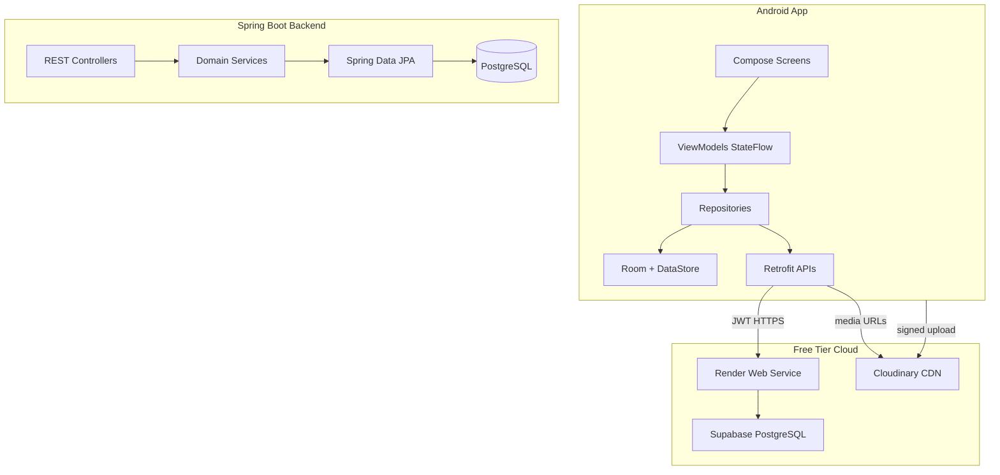
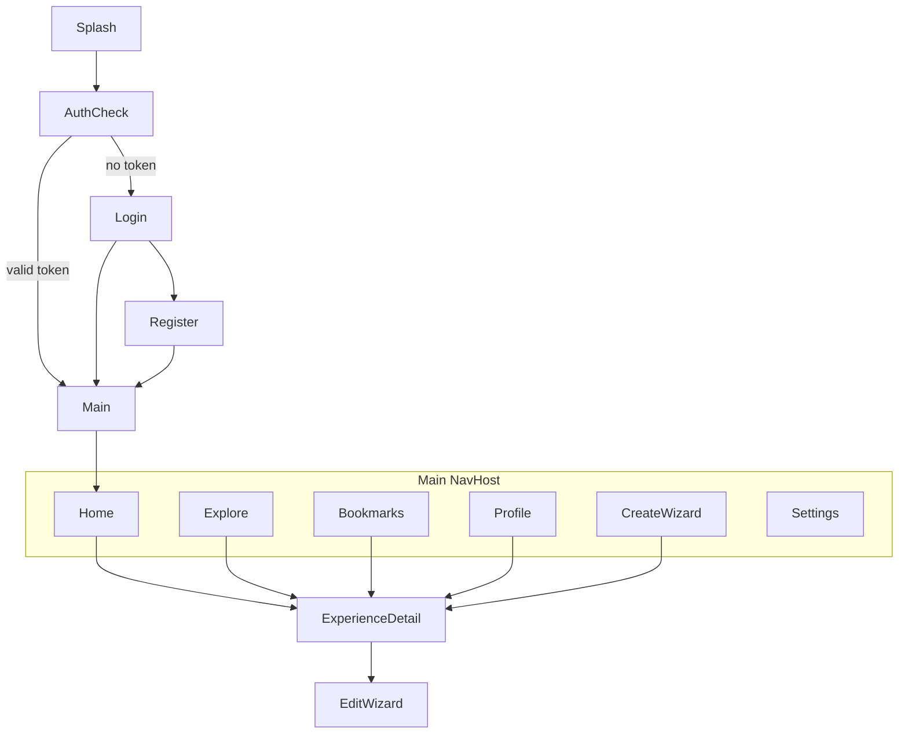

# TrailBook MVP — Implementation Plan

## Context

- **Workspace:** [`c:\Users\admin\Desktop\AndroidApp`](c:\Users\admin\Desktop\AndroidApp) is empty — greenfield build.
- **Approach:** Full-stack in parallel from day one.
- **Cloud target:** Render (Spring Boot) + Supabase PostgreSQL + Cloudinary (media). Supabase Storage reserved for future use; MVP media goes through Cloudinary signed uploads.

---

## Target Repository Layout

```
trailbook/
├── README.md
├── docs/
│   ├── architecture.md
│   ├── api-contract.md
│   └── deployment.md
├── android/
│   └── app/ + feature modules (see below)
├── backend/
│   ├── src/main/java/...
│   ├── Dockerfile
│   └── docker-compose.yml      # local Postgres for dev
├── api/
│   └── openapi.yaml            # source of truth for REST contract
├── postman/
│   └── TrailBook.postman_collection.json
└── .github/workflows/
    ├── android-ci.yml
    └── backend-ci.yml
```

### Android module structure (feature-first)

```
android/
├── app/                        # Application entry, NavHost, theme
├── core/
│   ├── common/                 # Result, UiState, extensions
│   ├── network/                # Retrofit, interceptors, JWT
│   ├── database/               # Room entities/DAOs
│   ├── datastore/              # session tokens, prefs
│   └── design/                 # Material 3 theme, reusable Compose components
└── feature/
    ├── authentication/
    ├── home/
    ├── explore/
    ├── experience/             # detail, create/edit wizard, comments
    └── profile/                # profile, bookmarks, settings
```

Each feature module follows: `data/` → `domain/` → `ui/` with Hilt modules binding repositories.

---

## Architecture Overview



**Key decisions:**
- **Single source of truth:** Room caches feed/detail; network refreshes via Repository + Paging 3.
- **Auth:** JWT access + refresh tokens stored in Encrypted DataStore; Retrofit interceptor attaches Bearer token.
- **Experience creation:** Multi-step wizard with local draft in Room until publish.
- **Media:** Android uploads directly to Cloudinary via backend-issued signature; DB stores URLs only.

---

## Data Model (MVP)

### Core entities (PostgreSQL / Room mirror)

| Entity | Key fields |
|--------|------------|
| `User` | id, username, email, displayName, avatarUrl, bio, createdAt |
| `Experience` | id, authorId, title, overview, destination, coverImageUrl, status (DRAFT/PUBLISHED), createdAt, updatedAt |
| `TimelineEntry` | id, experienceId, day, title, description, orderIndex |
| `BudgetItem` | id, experienceId, category, amount, currency, notes |
| `Accommodation` | id, experienceId, name, location, cost, notes |
| `FoodSpot` | id, experienceId, name, cuisine, cost, notes |
| `Transportation` | id, experienceId, mode, details, cost |
| `GalleryItem` | id, experienceId, imageUrl, caption, orderIndex |
| `Video` | id, experienceId, videoUrl, thumbnailUrl |
| `Tip` | id, experienceId, content |
| `PackingItem` | id, experienceId, item, checked (creator template only in MVP) |
| `Comment` | id, experienceId, userId, content, createdAt |
| `Like` | userId + experienceId (composite PK) |
| `Bookmark` | userId + experienceId (composite PK) |

---

## REST API Contract (MVP)

Base path: `/api/v1`

| Area | Endpoints |
|------|-----------|
| **Auth** | `POST /auth/register`, `POST /auth/login`, `POST /auth/refresh`, `POST /auth/logout` |
| **Feed** | `GET /experiences/feed?page&size`, `GET /experiences/search?q&destination&sort` |
| **Experience** | `GET/POST/PUT/DELETE /experiences/{id}`, `POST /experiences/{id}/publish` |
| **Sub-sections** | Nested CRUD under `/experiences/{id}/timeline`, `/budget`, `/accommodation`, `/food`, `/transportation`, `/gallery`, `/videos`, `/tips`, `/packing` |
| **Social** | `POST/DELETE /experiences/{id}/like`, `GET/POST /experiences/{id}/comments`, `POST/DELETE /experiences/{id}/bookmark` |
| **Profile** | `GET/PUT /users/me`, `GET /users/{id}`, `GET /users/me/bookmarks`, `GET /users/{id}/experiences` |
| **Media** | `POST /media/cloudinary-signature` (returns signature, timestamp, cloudName) |

OpenAPI spec lives in [`api/openapi.yaml`](api/openapi.yaml); Retrofit interfaces generated or hand-written to match.

---

## Phase-by-Phase Delivery

### Phase 1 — Project Setup (Days 1–3)

**Backend**
- Initialize Spring Boot 3.x (Java 21): Web, Security, JPA, Validation, OpenAPI.
- `docker-compose.yml` with local Postgres; prod profile points to Supabase connection string via env vars.
- Base packages: `config`, `auth`, `user`, `experience`, `social`, `media`, `common`.
- Global exception handler, CORS for Android, standardized `ApiResponse<T>` wrapper.
- Flyway migrations for schema v1.

**Android**
- Create multi-module Gradle project (Kotlin, Compose BOM, Material 3, Hilt, Navigation Compose, Retrofit, Room, Paging 3, Coil, DataStore).
- [`core/design`](android/core/design): color/typography tokens, light/dark theme, shared components (`ExperienceCard`, `SectionHeader`, `LoadingState`, `ErrorState`, `PrimaryButton`).
- [`app`](android/app): `TrailBookApp`, `MainActivity`, root `NavGraph`, splash screen.
- DI graph in [`app/di`](android/app/di).

**Docs & CI**
- Root README with setup instructions.
- GitHub Actions: backend `mvn test` + Android `assembleDebug` + lint.

**Exit criteria:** Both apps build; health check `GET /actuator/health` returns OK; Android shows themed splash → placeholder nav.

---

### Phase 2 — Authentication (Days 4–6)

**Backend**
- JWT access (15 min) + refresh (7 days) with Spring Security filter chain.
- `User` registration/login with BCrypt passwords.
- Refresh token rotation stored in DB.

**Android** — [`feature/authentication`](android/feature/authentication)
- Screens: Login, Register, Splash (session check).
- `AuthRepository` → DataStore for tokens, Retrofit for API.
- Auto-redirect: authenticated → Home; unauthenticated → Login.
- Logout clears DataStore + Room user cache.

**Exit criteria:** Register, login, persist session across app restart, logout works against local + Render-deployed backend.

---

### Phase 3 — Home Feed & Explore (Days 7–10)

**Backend**
- Paginated feed endpoint (published experiences, newest first).
- Search by title/destination with optional sort (recent, popular by like count).

**Android**
- [`feature/home`](android/feature/home): Paging 3 feed, pull-to-refresh, `ExperienceCard` with cover/title/destination/author/likes.
- [`feature/explore`](android/feature/explore): search bar, filter chips (destination), results list.
- Bottom navigation: Home | Explore | Create | Bookmarks | Profile.

**Exit criteria:** Feed loads paginated data; search returns filtered results; empty/error/loading states handled.

---

### Phase 4 — Experience Module (Days 11–18)

**Backend**
- Full experience CRUD with nested sections.
- Draft vs published status; only published appear in feed.
- Like, comment, bookmark endpoints with uniqueness constraints.

**Android** — [`feature/experience`](android/feature/experience)

**View Experience (detail screen)**
- Scrollable sections: Overview, Timeline, Budget, Accommodation, Food, Transportation, Gallery (Coil grid), Videos, Tips, Packing List, Comments.
- Actions: Like, Bookmark, Share (Android share intent), Comment input.

**Create / Edit wizard (9 steps per spec)**
1. Basic Info (title, overview, cover image)
2. Destination
3. Timeline (add/reorder days)
4. Budget
5. Accommodation
6. Food
7. Gallery (Cloudinary picker/upload)
8. Tips (+ Packing List)
9. Review & Publish

- Draft auto-saved to Room between steps; sync to backend on step completion.
- Edit reuses same wizard pre-filled from API.

**Exit criteria:** Full create → publish → view flow works; edit updates; comments/likes/bookmarks persist.

---

### Phase 5 — Profile, Bookmarks & Backend Hardening (Days 19–22)

**Android** — [`feature/profile`](android/feature/profile)
- Profile screen: avatar, bio, experience count, user's published experiences.
- Bookmarks tab (saved experiences list).
- Settings: theme toggle (light/dark/system), logout.

**Backend**
- Rate limiting on auth endpoints.
- Input validation on all DTOs.
- Seed data script for demo content.

**Cloudinary integration**
- Backend signature endpoint; Android upload worker; store returned URLs in experience gallery/cover.

**Exit criteria:** Profile and bookmarks functional; media upload end-to-end.

---

### Phase 6 — Testing, Deployment & Play Store Prep (Days 23–28)

**Testing**
- Backend: unit tests for auth service, experience service; integration tests with Testcontainers Postgres.
- Android: ViewModel unit tests (Turbine for Flow); critical UI tests (login, view experience) with Compose Test.

**Deployment**
- Supabase: create project, run Flyway migrations, store `DATABASE_URL` in Render env.
- Render: deploy Spring Boot Docker image; set JWT secret, Cloudinary keys, CORS origin.
- Cloudinary: unsigned upload preset disabled; signed uploads only.
- Firebase: add `google-services.json`, FCM stub (optional for MVP — document as TODO if time-constrained).

**Play Store readiness**
- App icon, splash assets, privacy policy placeholder.
- `versionCode`/`versionName`, ProGuard rules for Retrofit/Gson.
- Internal testing track build (AAB).

**Exit criteria:** Production backend URL in Android `BuildConfig`; CI green; internal test build installable.

---

## Android Navigation Map



---

## Design System (Material 3)

Implement in [`android/core/design`](android/core/design):

- **Typography:** Display for experience titles, Body Large for section content (Notion-like readability).
- **Color:** Earth-tone primary (trail/nature), neutral surfaces, high-contrast text.
- **Components:** `ExperienceCard`, `TimelineDayCard`, `BudgetRow`, `CommentThread`, `WizardStepIndicator`, `ImagePickerGrid`.
- **Motion:** Shared element transition on cover image (detail); step slide animation in wizard.
- **Accessibility:** content descriptions, 48dp touch targets, dynamic font scaling support.

---

## Environment & Secrets

| Variable | Where |
|----------|-------|
| `DATABASE_URL` | Render (Supabase connection string) |
| `JWT_SECRET`, `JWT_REFRESH_SECRET` | Render |
| `CLOUDINARY_CLOUD_NAME`, `CLOUDINARY_API_KEY`, `CLOUDINARY_API_SECRET` | Render |
| `API_BASE_URL` | Android `local.properties` / `BuildConfig` per build type |
| `CLOUDINARY_CLOUD_NAME` | Android (public) |

Never commit secrets; use `.env.example` templates in both projects.

---

## Risk Mitigation

| Risk | Mitigation |
|------|------------|
| Large wizard scope | Save draft per step; ship without offline sync first |
| Supabase + JPA dialect quirks | Test Flyway on Supabase early in Phase 1 |
| Render cold starts | Android retry interceptor + loading states |
| Media upload failures | Queue failed uploads; allow publish without gallery |

---

## Definition of Done (MVP)

- All 10 MVP features from spec work against deployed backend: Auth, Home Feed, Explore/Search, Experience Details, Create, Edit, Profile, Like, Comment, Bookmark, Share.
- Light + dark mode.
- Clean Architecture with feature modules, Hilt, Repository pattern, StateFlow.
- CI passes; backend on Render; DB on Supabase; images on Cloudinary.
- Documented setup in README; OpenAPI spec matches implementation.
